## FastAPI 框架精讲
> 整体的介绍 FastAPI，快速上手开发，结合 API 交互文档逐个讲解核心模块的使用

体验新一代高性能 Python Web 框架，本课程将从 Hello World 开始引导同学们学习 FastAPI 框架的所有知识点。从框架特性一览，到 ASGI 服务介绍，第三章开始会以全球  COVID-19 感染数据查询为功能场景，依次讲解 FastAPI 的 API 交互文档使用，如何使用 Pydantic 定义和规范数据格式、类型，各种请求参数和验证，Jinja2 模板渲染和 Static 静态文件配置，FastAPI 的响应处理和配置，通过代码示例讲解依赖注入系统的所有知识，数据库配置与 SQLAlchemy 的使用，大型工程应该如何设计目录结构。框架的安全、认证、授权，中间件开发，跨域资源共享的实现，后台任务和测试用例的编写。

### 课程12个核心技术点

1. 了解 FastAPI 框架特性，相对 Django/Flask 的优势
2. Pydantic 定义和规范数据格式、类型
3. 如何定义各种请求参数和验证，包括路径参数、查询参数、请求体、cookie、header
4. Jinja2 模板渲染和 Static 静态文件配置
5. FastAPI 的表单数据处理、错误处理、响应模型、文件处理、路径操作配置等
6. 全面学习 FastAPI 的依赖注入系统
7. FastAPI 的安全、认证和授权，OAuth2 认证和 JWT 认证的实现
8. FastAPI 的数据库配置与 SQLAlchemy ORM 的使用
9. 大型工程应该如何目录结构设计，多应用的文件拆分
10. FastAPI 的中间件开发
11. FastAPI 中跨域资源共享 CORS 的原理和实现方式
12. 如何编写后台任何和测试用例"		

### 适合人群

任何想学习Python开发的同学，尤其是需要高效率完成高并发、高性能项目的同学。

### 课程效果展示

1.  简易版前端效果
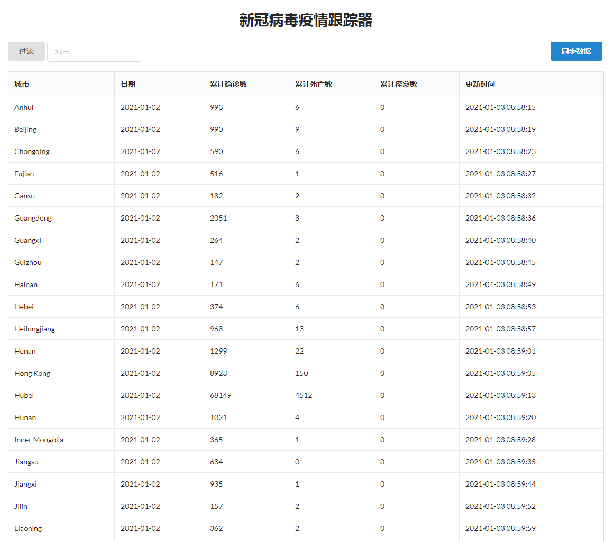
2.  API交互文档 - **Swagger UI**
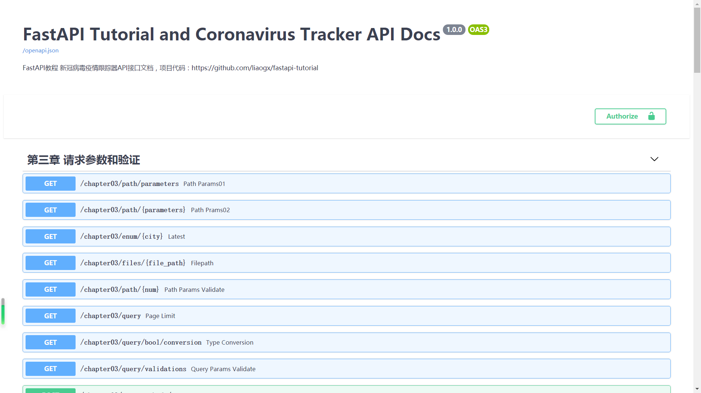
3.  第三章的接口

4.  第四、五章的接口

5.  接口的参数、返回的状态码、描述
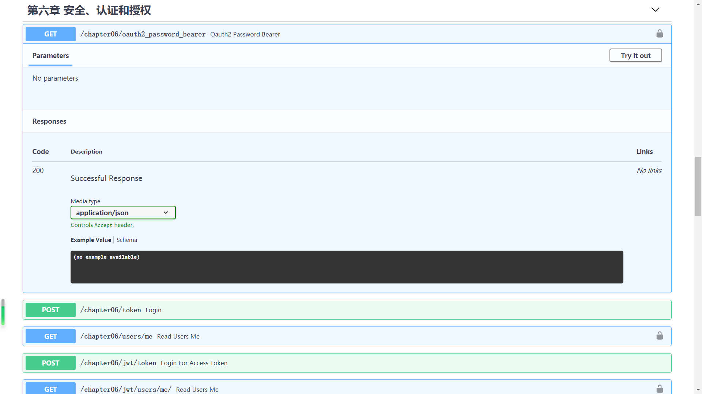
6.  接口认证的效果
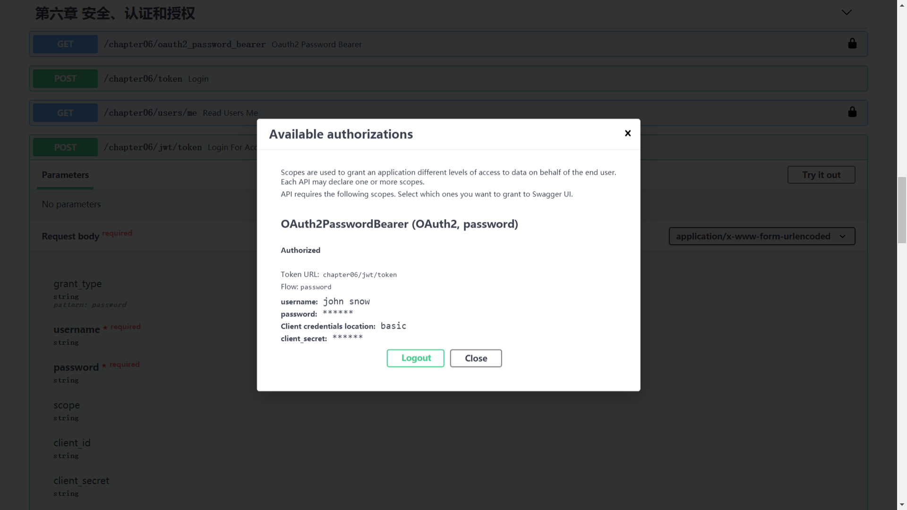
7.  第七、八章和`Coronavirus`应用的接口
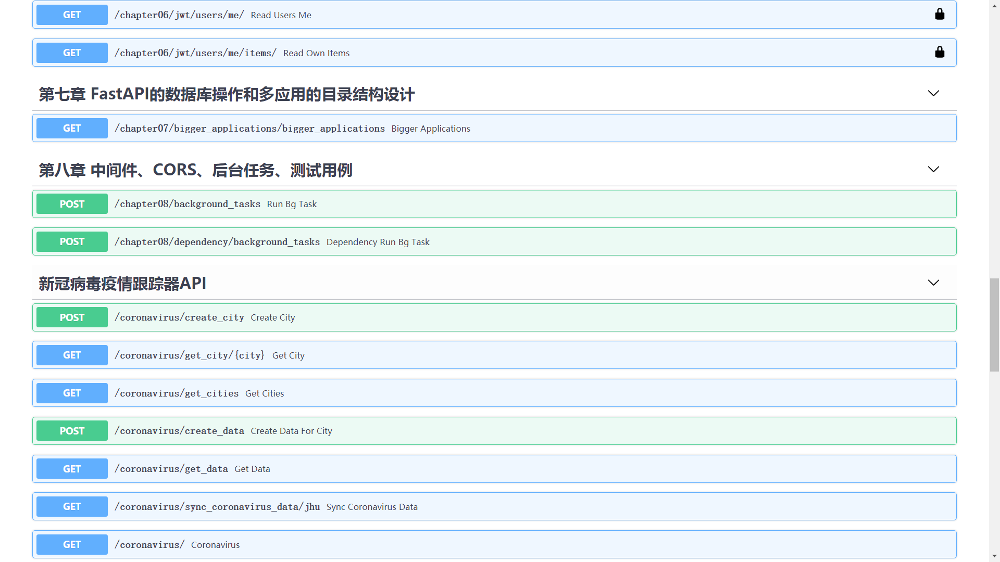
8.  城市信息表
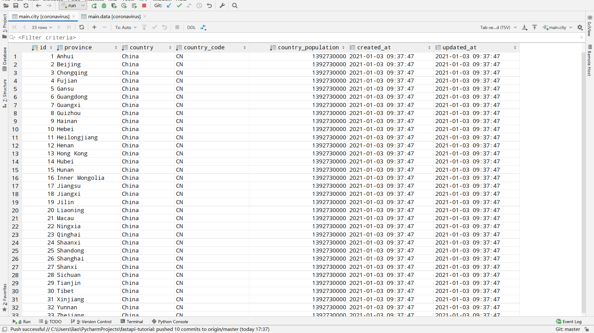
9.  感染数据表
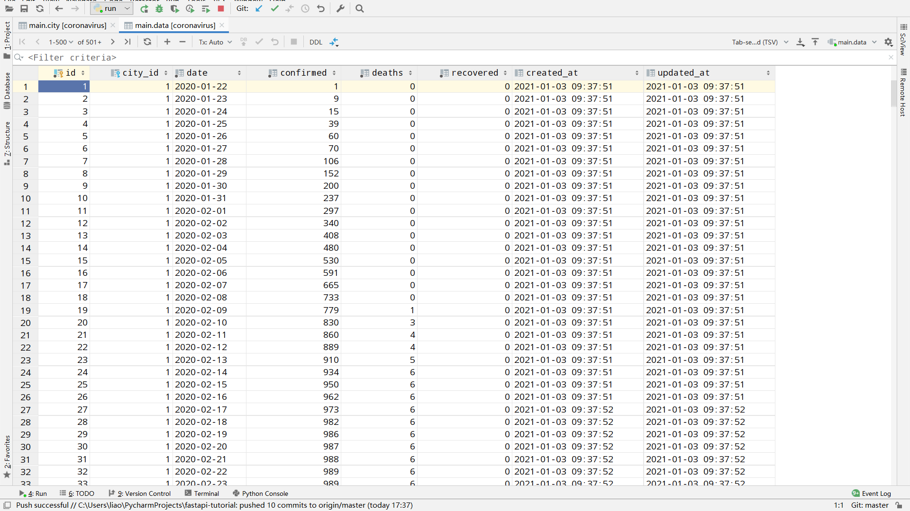

### 第一章 课程介绍

#### 1.1 课程内容与导学

介绍本课程的学习内容和目标，如何学习本课程，展示最终代码和效果，引导同学们对  FastAPI 框架有一个基本的了解，并能够在课程结束后独立使用 FastAPI 完成 RESTful API 接口开发。

### 第二章 FastAPI介绍和项目准备

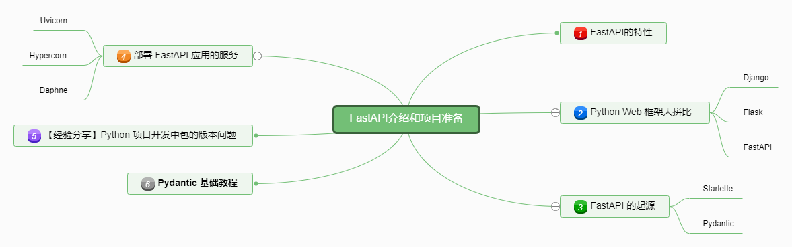

#### 2.1 本章导学

图文列举本章节要讲的内容

#### 2.2 为什么新秀 FastAPI 火成这样 ?

介绍 FastAPI 有哪些突出特点，浏览官网文档中的 Feasures 一览

#### 2.3 Django vs Flask vs FastAPI 三框架大拼比

从开发效率、性能测评、框架生态、社区支持、学习难易程度多个角度对比 Django/Flask/FastAPI。性能评测参考 [https://www.techempower.com/benchmarks](https://www.techempower.com/benchmarks) 的Web Framework Benchmarks

#### 2.4 Starlette，Pydantic 与 FastAPI 框架是什么关系？

介绍  Starlette 是个什么项目；IDE 开发时 Python 3.5+ 版本的 "type hints" 的好处：简短、直观和标准的 Python 类型声明；介绍 Pydantic 包，FastAPI  项目的开发为什么要使用 Pydantic

#### 2.5 ASGI 服务 Uvicorn 和 Hypercorn 介绍

讲解什么是 ASGI 服务，介绍部署 FastAPI 项目需要用到的 Uvicorn 或 Hypercorn

#### 2.6 搭建 FastAPI 项目开发环境

使用 Virtualenv 搭建 FastAPI  项目开发环境，安装 FastAPI，Pydantic，Uvicorn 等

#### 2.7 经验分享-Python 项目开发中包的版本问题

基于之前的课程经验，给同学们重点提示 Python 项目开发中包的版本问题，如何阅读报错信息，怎么解决不同依赖包版本不兼容的问题。

#### 2.8 Pydantic 基础教程

边写代码边讲解基本模型及常用方法，递归模型，字段类型，校验，模型类配置

#### 2.9 本章小结&下章内容预告

总结本章的知识点，回顾重难点，下章内容预告

### 第三章 请求参数和验证

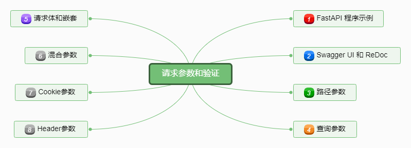

#### 3.1 本章导学

图文列举本章节要讲的内容

#### 3.2 "hello world" 接口给后端传 COVID-19 感染数据

首先运行一个简单的 FastAPI 程序，实现返回 "hello world" 的接口；进一步，继承 Pydantic 的 BaseModel 规范请求体数据格式和类型，通过查询参数和请求体传递城市、所在国家、是否有感染病例的信息，讲解 FastAPI 框架的基本开发方法，同步和异步函数的编写、装饰器、URL 路由、HTTP 方法

#### 3.3 FastAPI 的 API 交互文档 - Swagger UI 和 ReDoc

接着上一小节开发的接口功能，API 交互文档一览，使用方法介绍；另一个可用的 API 交互文档 ReDoc

#### 3.4 路径参数和数据的解析、验证

路径参数的类型，错误检查，自动填充，数据转换、解析、验证（包括数字大小范围的验证），参数别名，API 交互文档中传参演示

#### 3.5 查询参数和数据的解析、验证

讲解查询参数的传参方式，类型转换，多路径参数和查询参数的使用，必填查询参数；模拟一个能选择数据源，查询今日全球 COVID-19 感染数据的接口

#### 3.6 请求体以及混合参数

用 Pydantic 的 BaseModel 和 Field 类定义请求体数据格式和类型，如何定义多个请求体，请求体和路径参数，查询参数的混合使用；

#### 3.7 如何定义数据格式嵌套的请求体？

通过 Python 类的继承，结合 typing 和  Pydantic 的 Field 类，用嵌套的模型类定义数据格式嵌套的请求体

#### 3.8 如何设置 Cookie 和 Header 参数？

用 FastAPI 的 Cookie 类实现在后端定义 Cookie 的参数，用 Header 类实现在后端定义请求头的参数，请求头参数自动转换功能介绍，请求头参数中重复的 key 如何处理

#### 3.9 本章小结&下章内容预告

总结本章的知识点，回顾重难点，下章内容预告

### 第四章 响应处理和FastAPI配置

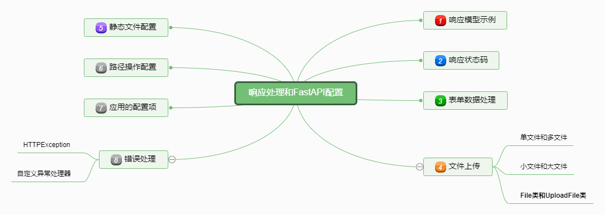

#### 4.1 本章导学

图文列举本章节要讲的内容

#### 4.2 响应模型示例精讲

响应模型的声明和调用，response_model 指定默认值或响应模型，response_model_exclude_unset、response_model_include和response_model_exclude 参数含义

#### 4.3 响应状态码和快捷属性

status_code 参数定义，fastapi.status 快捷调用响应状态码属性

#### 4.4 表单数据处理

导入 FastAPI 的 Form 类，代码演示如何定义表单参数

#### 4.5 单文件、多文件上传及参数详解

讲解 File 和 UploadFile 类，及其参数的定义，多文件上传的实现；以解析 COVID-19.csv 文件数据为例

#### 4.6 FastAPI 项目的静态文件配置

CSS/JS/IMAGES 静态文件的配置，项目如何找到 Static 文件夹

#### 4.7 路径操作配置(Path Operation Configuration)

Path Operation Configuration的概念，包括 Response Status Code、Tags、Summary and description、文档描述符、响应描述、Deprecate 参数

#### 4.8 FastAPI 应用的常见配置项

配置 FastAPI 应用的标题、描述、版本，tags 的元数据，自定义 OpenAPI 和文档的 URL

#### 4.9 FastAPI 框架的错误处理

HTTPException 的使用，如何自定义异常处理器；给第六小节开发的 COVID-19 数据查询接口定义异常处理

#### 4.10 本章小结&下章内容预告

总结本章的知识点，回顾重难点，下章内容预告

### 第五章 FastAPI的依赖注入系统

#### 5.1 本章导学

图文列举本章节要讲的内容

#### 5.2 什么是依赖注入系统？

依赖的概率，依赖注入系统的作用，有哪些使用场景

#### 5.3 创建、导入和声明依赖

代码演示如何创建一个依赖，并在其它函数中调用，讲解 FastAPI 对依赖的处理过程

#### 5.4 如何将类作为依赖项？

将前面函数的例子封装成类，举例如何使用类作为依赖项；类型注释与依赖项的区别；依赖类的快捷编写

#### 5.5 子依赖的创建和调用

案例讲解多重（嵌套）依赖的调用，父依赖调用子依赖，子依赖再调用另外的子依赖

#### 5.6 路径操作装饰器中导入依赖

如何在路径操作装饰器中添加多个依赖，依赖的错误、返回值、异常处理

#### 5.7 FastAPI 框架中全局依赖的使用

讲解 FastAPI 框架中全局依赖的使用

#### 5.8 使用 yield 的依赖和子依赖

yield 在依赖函数中的作用，讲解数据库连接的案例

#### 5.9 本章小结&下章内容预告

总结本章的知识点，回顾重难点，下章内容预告

### 第六章 安全、认证和授权

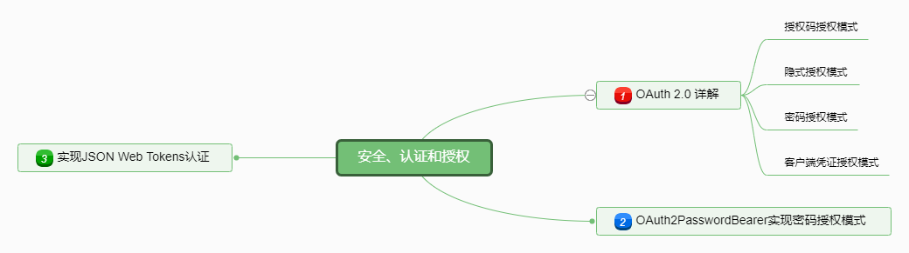

#### 6.1 本章导学

图文列举本章节要讲的内容

#### 6.2 OAuth2.0 认证和授权机制讲解

图文讲解 OAuth2.0 认证的概念和基本流程，四种授权模式

#### 6.3 OAuth2 密码模式和 FastAPI 的 OAuth2PasswordBearer

OAuth2 密码模式的认证过程， 继承OAuth2PasswordBearer类，使用 OAuth2 的密码模式，在请求头中携带 Authorization: Bearer your_token 实现认证

#### 6.4 基于 Password 和 Bearer token 的 OAuth2 认证

使用 FastAPI 提供的 OAuth2PasswordBearer 类，开发一个使用密码和 Bear token 的 OAuth2 认证模型，讲解认证原理

#### 6.5 开发基于 JSON Web Tokens 的认证

JSON Web Tokens介绍，安装 python-jose 和 passlib，实现 JWT 认证，用户登录后才能查询 COVID-19 感染数据；在 API 交互文档中测试实现效果

#### 6.6 本章小结&下章内容预告

总结本章的知识点，回顾重难点，下章内容预告

### 第七章 FastAPI的数据库操作和多应用的目录结构设计

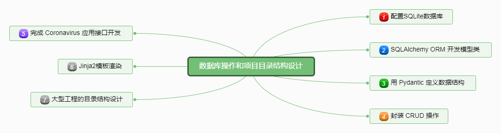

#### 7.1 本章导学

图文列举本章节要讲的内容

#### 7.2 FastAPI 项目中配置 SQLAlchemy ORM

SQLAlchemy ORM 介绍，FastAPI 项目中如何配置SQLite数据库，应用的文件结构

#### 7.3 SQLAlchemy 开发 COVID-19 模型类

开发 COVID-19 的城市和感染数据模型类，讲解模型类中各字段和字段属性

#### 7.4 使用 Pydantic 建立与模型类对应的数据格式类

对于上一小节开发的城市和感染数据模型类，继承 pydantic.BaseModel 分别开发对应的创建和读取数据的数据格式类

#### 7.5 把创建和查询 COVID-19 数据封装成函数

创建 crud.py 把创建和查询 COVID-19 数据封装成函数，在函数中通过SQLAlchemy ORM实现对SQLite的CRUD操作

#### 7.6 开发 COVID-19 感染数据查询接口

调用上一小节的函数，实现创建城市，查询城市信息和各个城市每日感染病例数据的接口

#### 7.7 Jinja2 模板渲染前端页面

FastAPI 项目中 Jinja2 配置，使用 Jinja2 渲染 COVID-19 查询页面，完成前端页面的开发

#### 7.8 大型工程的目录结构设计 - 应用文件拆分

对于大型项目，很多的应用应该如何组织目录结构；APIRouter 使不同应用文件更加清晰，便于维护

#### 7.9 本章小结&下章内容预告

总结本章的知识点，回顾重难点，下章内容预告

### 第八章 中间件、CORS、后台任务、测试用例

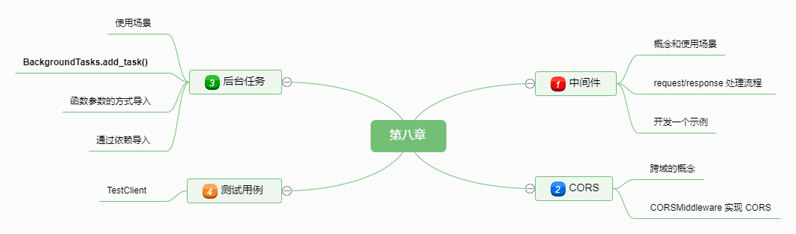

#### 8.1 本章导学

图文列举本章节要讲的内容

#### 8.2 中间件的概念和开发示例

中间件的概念，对 request 和 response 的处理流程，需要中间件开发的场景；使用 app.middleware("http") 装饰器创建一个中间件，在响应头中加上对每个 request 处理时间的键值对，演示response前后的处理

#### 8.3 跨域资源共享 CORS 的原理

域的概念（协议、域名、端口），什么是跨域、跨域资源共享

#### 8.4 FastAPI 的 CORSMiddleware 实现 CORS

讲解 FastAPI 的 CORSMiddleware 开发方法，其支持的参数以及含义

#### 8.5 实现类似 Celery 的后台任务

后台任务的使用场景，开发一个简单的后台任务，通过函数参数或依赖注入导入后台任务

#### 8.6 后台任务更新 COVID-19 数据

先说下 COVID-19 全球数据源的问题，对接 [https://coronavirus-tracker-api.herokuapp.com](https://coronavirus-tracker-api.herokuapp.com) 的数据源，后台任务的方式将数据更新到数据表，前端只需要一个点击按钮

#### 8.7 TestClient 编写测试用例

用 FastAPI 的 TestClient 编写3个简单的测试用例，测试上一小节的后台任务接口；讲解测试用例的开发思路

#### 8.8 本章小结

总结本章的知识点，回顾重难点

### 第九章 课程总结

#### 9.1 课程总结

回顾课程内容与重难点，总结经验、心得以及扩展建议。